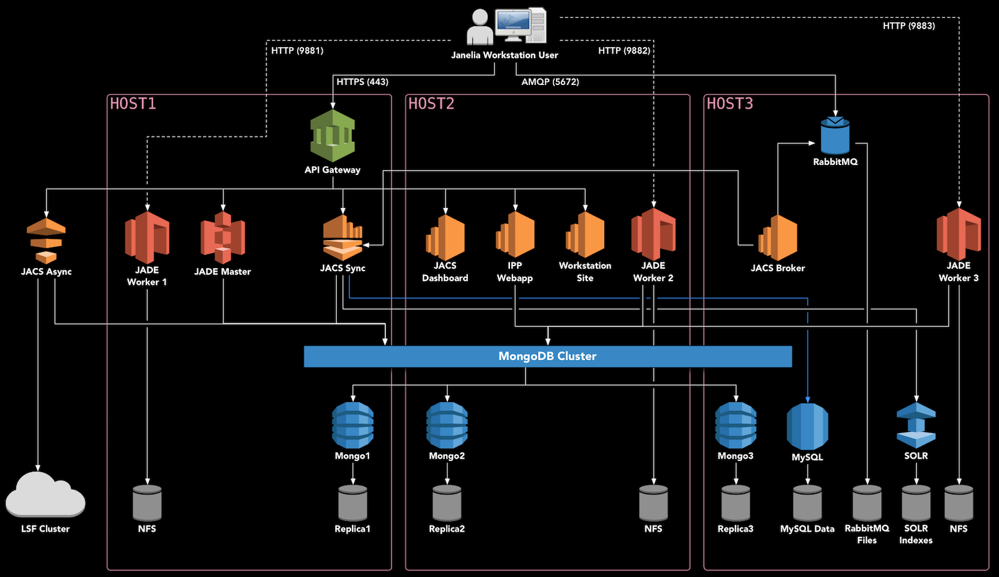

# Full Deployment

This document describes the full three-server Janelia Workstation deployment for supporting both FlyLight and MouseLight at Janelia Research Campus. This deployment uses Docker Swarm to orchestrate containers available on Docker Hub.

Multiple *environments* are supported with this deployment:
* **prod** - containers are always pinned to the latest production versions
* **dev** - containers are deployed with the "latest" tag, and updated automatically using [Shepherd](https://github.com/djmaze/shepherd) whenever a new container is available in the registry. This simplifies development and CI/CD.

## Deployment Diagram

<div style="text-align:center"></div>


## Hardware Setup

This guide assumes that you have three high-end servers which can be dedicated to running Docker Swarm. We use 40-core servers with at least 192 GB of RAM. YMMV.

We'll refer to the three deployment hosts as **HOST1**, **HOST2**, and **HOST3**. 

Note that an additional server or VM is necessary to run the JACS Async Services outside of Docker, if you are planning to submit image processing jobs to an HPC cluster, such as with the Image Processing Pipeline (IPP).


## Install Scientific Linux 7

The backend software should run on any operating system which supports Docker. However, Scientific Linux is used at Janelia and has been extensively tested with this software. Therefore, we recommend installing the latest version of Scientific Linux 7 or CentOS 7.


## Install Docker

To install Docker and Docker Compose on Scientific Linux 7, follow [these instructions](InstallingDockerSL7.md).


## Setup Docker Swarm

On **HOST1**, bring up swarm as a manager node, and give it a label:
```
docker swarm init
```

On **HOST2** and **HOST3**, copy and paste the output of the previous command to join the swarm as a worker.

```
docker swarm join --token ...
```

All further commands should be executed on **HOST1**, i.e. the master node. One final step is to label the nodes. Each node needs the "jacs=true" label, as well as "jacs_name=nodeX". You can find out the node ids by running `docker node ls`.
```
docker node update --label-add jacs_name=node1 <id of HOST1>
docker node update --label-add jacs_name=node2 <id of HOST2>
docker node update --label-add jacs_name=node3 <id of HOST3>
docker node update --label-add jacs=true <id of HOST1>
docker node update --label-add jacs=true <id of HOST2>
docker node update --label-add jacs=true <id of HOST3>
```


## Download the installer

Download the installer and extract it onto the master node, as follows. `VERSION` should be set to the [latest stable version](https://github.com/JaneliaSciComp/jacs-cm/releases) available on the releases page.

```
export VERSION=<version_number_here>
cd /opt
sudo mkdir deploy
sudo chown $USER deploy
cd deploy
curl https://codeload.github.com/JaneliaSciComp/jacs-cm/tar.gz/$VERSION | tar xvz
ln -s jacs-cm-$VERSION jacs-cm
cd jacs-cm
```


## Configure The System

Next, create a `.env.config` file inside the installer directory. This file defines the environment (usernames, passwords, etc.) You can copy the template to get started:
```
cp .env.template .env.config
vi .env.config
```

At minimum, you must customize the following:
1. Ensure that `REDUNDANT_STORAGE` and `NON_REDUNDANT_STORAGE` point to the disk mounts available on the local systems. Alternatively, you can make symbolic links so that the default paths point to your mounted disks.
2. Set `HOST1`, `HOST2`, and `HOST3` to the servers you are deploying on. Use fully-qualified hostnames here -- they should match the SSL certificate you intend to use.
3. Fill in all the unset passwords with >8 character passwords. You should only use alphanumeric characters, special characters are not currently supported.
4. Generate 32-byte secret keys for JWT_SECRET_KEY and MONGODB_SECRET_KEY.


## Enable Databases (optional)

Currently, Janelia runs MongoDB and MySQL outside of the Swarm, so they are commented out in the deployment. If you'd like to run the databases as part of the swarm, edit the yaml files under ./deployments/jacs/ and uncomment the databases.


## Deploy Services

Now you can follow the [Swarm Deployment instructions](SwarmDeployment.md) to actually deploy the software.


## Find More Information

This concludes the Workstation installation procedure. Further information on using the tools can be found in the [Janelia Workstation User Manual](https://github.com/JaneliaSciComp/workstation/blob/master/docs/UserManual.md).

