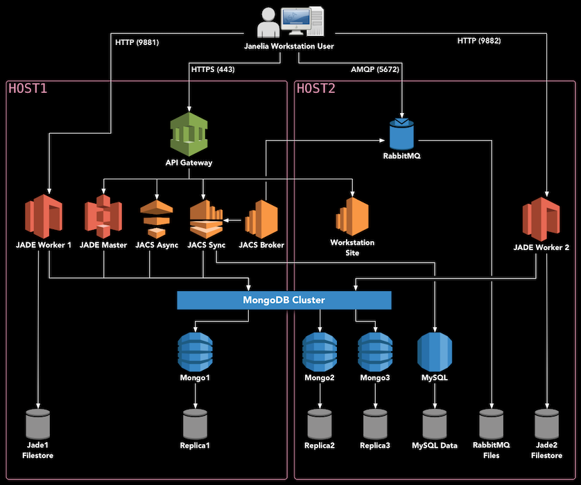

# MouseLight Deployment

This document describes the canonical two-server Janelia Workstation deployment for supporting neuron tracing for the [MouseLight project](https://www.janelia.org/project-team/mouselight) at the Janelia Research Campus and other research institutions. This deployment uses Docker Swarm to orchestrate prebuilt containers available on Docker Hub.

Please note that this deployment does not currently have the capability of preprocessing raw data. Instead, it's assumed that imagery will be generated and preprocessed at Janelia and shipped to the remote site for viewing and tracing. These data preprocessing tools will be added in the future.

## Deployment Diagram

<div style="text-align:center"></div>


## Hardware Setup

The JACS backend consists of several services which need to be deployed on server hardware. We have tested the following configuration:

* Two Dell PowerEdge R740XD Servers
    * Each server has 40 cores (e.g. Intel Xeon Gold 6148 2.4G)
    * Each server has 192 GB of memory
    * The hard drives are configured as follows:
        * 2 x 200GB SSD - Operating system (/)
        * 2 x 960GB SSD in RAID1 - Databases, user preferences, etc. (/opt)
        * 12 x 10TB in RAID6 - Image files (/data)

The rest of this guide assumes that you have two server hosts dedicated to deploying this system, which are configured as listed above. They will be referred to as **HOST1** and **HOST2**.

This two-server deployment can support 5-10 concurrent users. We use the following configuration for client machines:

* Dell Precision 5820 Tower
    * Minimum of 8 cores (e.g. Intel Xeon W-2145 3.7GHz)
    * 128 GB of memory
    * Nvidia GTX1080Ti 11GB (reference card, blower fan style)
        * Other similar cards will work fine: GTX1070, GTX1080, RTX2080
    * Windows 10


## Install Scientific Linux 7

The backend software should run on any operating system which supports Docker. However, Scientific Linux is used at Janelia and has been extensively tested with this software. Therefore, we recommend installing the latest version of Scientific Linux 7 or CentOS 7.


## Install Docker

To install Docker and Docker Compose on Scientific Linux 7, follow [these instructions](InstallingDockerSL7.md).


## Setup Docker Swarm

On **HOST1**, bring up swarm as a manager node, and give it a label:
```
docker swarm init
```

On **HOST2**, copy and paste the output of the previous command to join the swarm as a worker.

```
docker swarm join --token ...
```

All further commands should be executed on **HOST1**, i.e. the master node. One final step is to label the nodes. Each node needs the "jacs=true" label, as well as "jacs_name=nodeX".
```
docker node update --label-add jacs_name=node1 $(docker node ls -f "role=manager" --format "{{.ID}}")
docker node update --label-add jacs_name=node2 $(docker node ls -f "role=worker" --format "{{.ID}}")
docker node update --label-add jacs=true $(docker node ls -f "role=manager" --format "{{.ID}}")
docker node update --label-add jacs=true $(docker node ls -f "role=worker" --format "{{.ID}}")
```

Finally, you can run this command to ensure that both nodes are up and in Ready status:
```
docker node ls
```

## Download the installer

[Download the jacs-cm latest installer](https://github.com/JaneliaSciComp/jacs-cm/releases) and extract it onto the master node, as follows. `VERSION` should be set to the latest stable version available on the releases page.

```
export VERSION=<version_number_here>
cd /opt
sudo mkdir deploy
sudo chown $USER deploy
cd deploy
curl https://codeload.github.com/JaneliaSciComp/jacs-cm/tar.gz/$VERSION | tar xvz
ln -s jacs-cm-$VERSION jacs-cm
cd jacs-cm
```


## Configure The System

Next, create a `.env.config` file inside the intaller directory. This file defines the environment (usernames, passwords, etc.) You can copy the template to get started:
```
cp .env.template .env.config
vi .env.config
```

At minimum, you must customize the following:
1. Set `DEPLOYMENT` to **mouselight**.
2. Ensure that `REDUNDANT_STORAGE` and `NON_REDUNDANT_STORAGE` point to the disk mounts you used during the operating system installation. Alternatively, you can make symbolic links so that the default paths point to your mounted disks.
3. Set `HOST1` and `HOST2` to the two servers you are deploying on. Use fully-qualified hostnames here -- they should match the SSL certificate you intend to use.
4. Fill in all the unset passwords with >8 character passwords. You should only use alphanumeric characters, special characters are not currently supported.
5. Generate 32-byte secret keys for JWT_SECRET_KEY and MONGODB_SECRET_KEY.


## Deploy Services

Now you can follow the [Swarm Deployment instructions](SwarmDeployment.md) to actually deploy the software.


## Import Imagery

The data for MouseLight comes as a directory containing TIFF images organized into octrees. You should place each sample in $DATA_DIR/jacsstorage/samples on one of the servers. If you place the sample on the first server, in `$DATA_DIR/jacsstorage/samples/<sampleDirectoryName>`, then in the Workstation you will refer to the sample as `/jade1/<sampleDirectoryName>`.

In the Workstation, select **File** → **New** → **Tiled Microscope Sample**, and then set "Sample Name" to `<sampleDirectoryName>` and "Path to Render Folder" as `/jade1/<sampleDirectoryName>`.

Open the Data Explorer (**Window** → **Core** → **Data Explorer**) and navigate to Home, then "3D RawTile Microscope Samples", and your sample name. Right-click the sample and choose "Open in Large Volume Viewer". The 2D imagery should load into the middle panel. You should be able to right-click anywhere on the image and select "Navigate to This Location in Horta (channel 1)", to load the 3D imagery.


## Find More Information

This concludes the MouseLight Workstation installation procedure. Further information on using the tools can be found in the [Janelia Workstation User Manual](https://github.com/JaneliaSciComp/workstation/blob/master/docs/UserManual.md).

